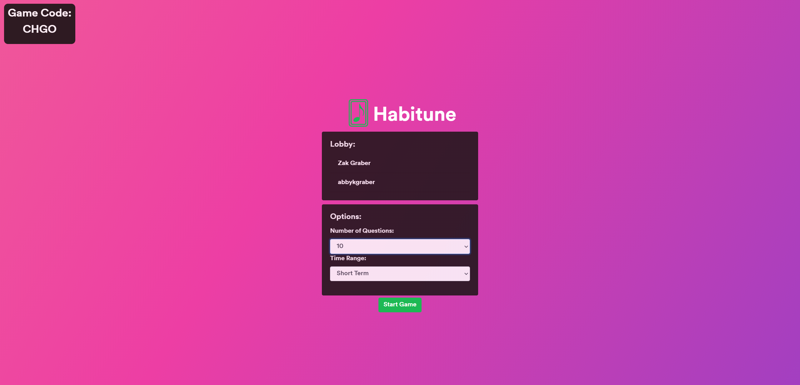
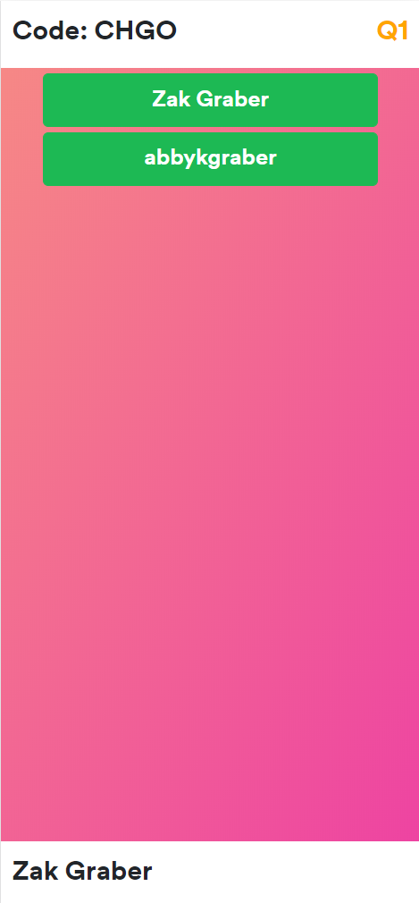

# Habitune
Habitune is a group/party game that uses Spotify’s analytics to provide insight into players’ listening habits and then tests the party on how well they know their own music tastes, and more importantly, how well they know their friends’ music tastes.

## Screenshots

